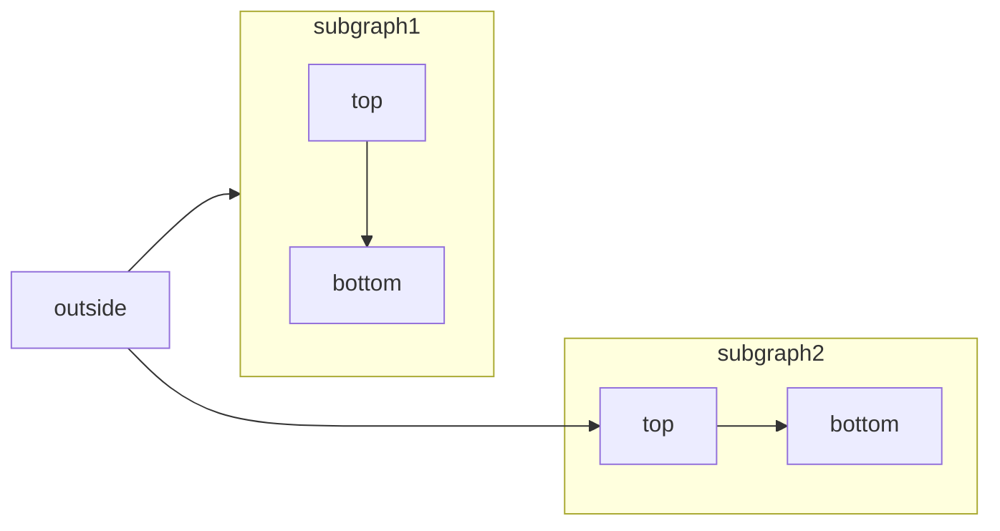

## Listener Scale

```bash
    php artisan listener:scale
```

This command runs every 5 minutes as an auto scaling solution to ensure that the number of listeners will up scale on demand, and also down scale if nesscessary.
Check the following figure to see the code detail

<Frame>
  
</Frame>
## Listener Restart

```bash
    php artisan listener:restart
```

This command runs every 2 hours to detected if there are disconnected listener connections. If found one, it will find the process id and kill it so, the supervisor will perform the listener restart.
Check the following figure to see the code detail

<Frame>
  
</Frame>

## Server Sync

This command runs every 10 minutes to ensure the server created inside database will have the correct IP address. The logic will trigger when:

- Auto scaling logic order a new server
- We deploy a new listener server

```bash
    php artisan server:sync
```

## Connection Sync

This command runs every 5 minutes to synchronize the connections from rabbitmq to the database. The logic will trigger when :

- We deploy a new listener server with listener configurations
- We deploy new listener manually

```bash
    php artisan connection:synchronize
```

[Mermaid](https://mermaid.js.org/) lets you create visual diagrams using text and code.


